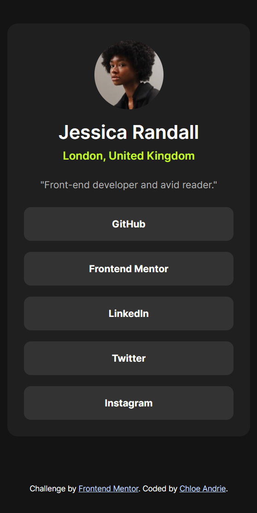

# Frontend Mentor - Social links profile solution

This is a solution to the [Social links profile challenge on Frontend Mentor](https://www.frontendmentor.io/challenges/social-links-profile-UG32l9m6dQ). Frontend Mentor challenges help you improve your coding skills by building realistic projects.

## Table of contents

- [Overview](#overview)
  - [The challenge](#the-challenge)
  - [Screenshot](#screenshot)
  - [Links](#links)
- [My process](#my-process)
  - [Built with](#built-with)
  - [What I learned](#what-i-learned)
  - [Continued development](#continued-development)
  - [Useful resources](#useful-resources)
- [Author](#author)
- [Acknowledgments](#acknowledgments)

## Overview

### The challenge

Users should be able to:

- See hover and focus states for all interactive elements on the page

### Screenshot

### Links

- Solution URL: [https://github.com/chloeandrie/social-links-profile-main](https://github.com/chloeandrie/social-links-profile-main)
- Live Site URL: [ https://chloeandrie.github.io/social-links-profile-main/](https://chloeandrie.github.io/social-links-profile-main/)

## My process

### Built with

- Semantic HTML5 markup
- CSS custom properties
- Flexbox
- CSS Grid
- Mobile-first workflow

### What I learned

I realized how difficult it is to work without Fimga files. I wasn't sure what the hover and focus states were meant to look like for the interactive elements, so I made up my own.

### Continued development

I'm continuing to work on accessibility and correct semantics.

### Useful resources

- [MDN](https://developer.mozilla.org/en-US/docs/Web/CSS/box-sizing) - MDN is a resource I always use for quick reference. I really liked the way information is presented and will use it going forward.

## Author

- Frontend Mentor - [@chloeandrie](https://www.frontendmentor.io/profile/chloeandrie)

## Acknowledgments

Thank you Frontend Mentor for the challenge! Looking forward to the next one.
